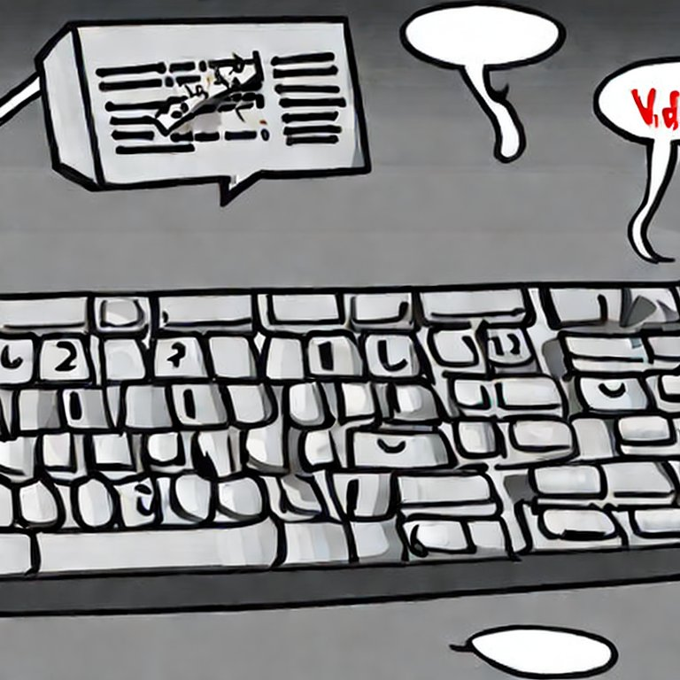

# Architecture

## Handling time

- `game` holds the main in-game time.
- At the start:
    - The game time is zero
    - Each `piece` its (assumed) in-game time is zero 
- Upon `game::tick`:
    - It is checked that `game` and each `piece` assume the same in-game time
    - The game time is updated
    - Each `piece` updates its idea of in-game time.
    - It is checked again that `game` and each `piece`
      assume the same in-game time. Pieces that are lagging did not update.

## Handling user input

```mermaid
sequenceDiagram
    participant user
    participant game_view
    participant controller
    participant game
    participant chess_piece
    user->>game_view: sf::event
    Note right of game_view: game_view::process_events
    game_view->>user: For universal input (e.g. F4): done!
    Note right of game_view: process_events(game_view&, sf::event&)
    game_view->>controller: sf::event
    Note right of controller: controller::process_input
    controller->>user: If no keys in key and mouse bindings: done!
    controller->>game: control_action
    Note right of game: game::add_action
    Note right of game: game::process
    game->>user: If no valid control_actions: done!
    game->>chess_piece: piece_action
    Note right of chess_piece: chess_piece::add_action
    Note right of chess_piece: chess_piece::tick
    chess_piece->>chess_piece: process all piece_actions until all are done
```

The key and mouse talk to `user_inputs`, or: `user_inputs` handles all the `sf::Event`s.
However, not all events are valid. For example, an LMB can be ignored if all players
use the keyboard. `user_inputs` only keeps the keys that are setup in the
'Key Settings'/'Controls' dialog.

Input                   |Class                               |Output
------------------------|------------------------------------|---------------------------------------
keyboard and mouse input|`user_inputs`  |Store valid input, ignore invalid input

`game_controller` gets all `user_inputs` and moves the right cursor (there is one cursor
for each player) to the right spots. It can select a piece to do a chess move.

Input                   |Class                                       |Output
------------------------|--------------------------------------------|---------------------------------------
Valid input             |`game_controller`  |Moves the cursor, does chess moves

The chess moves that `game_controller` suggests may not be valid and do not
move pieces. `game` checks if the chess move is valid and if yes, does the move.

Input                   |Class                                       |Output
------------------------|--------------------------------------------|-----------------------------------------------------------
Chess  moves            |`game`                        |Performs the valid chess moves, ignores invalid chess moves

