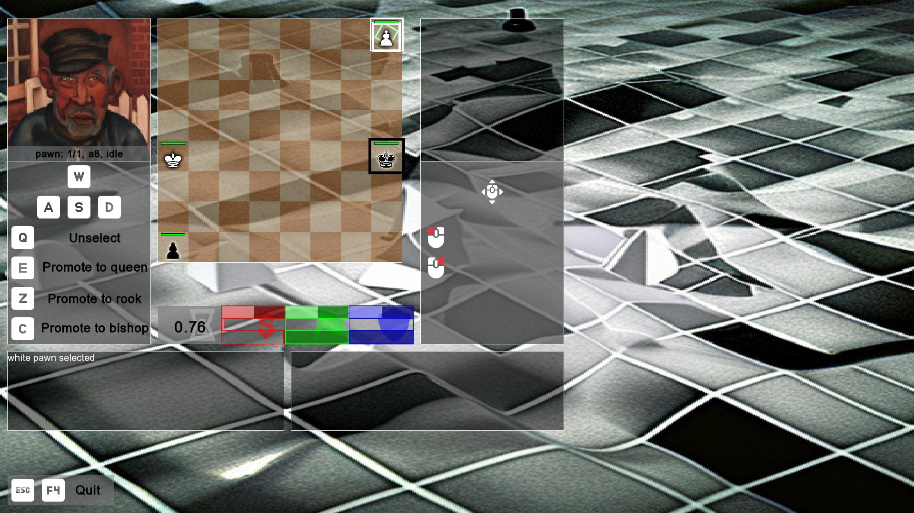

# Frequently Asked Questions

## General

### What is Conquer Chess?

Conquer Chess is a real-time strategy game
that is a mix between chess and some classic real-time strategy games.

### Why the name 'Conquer Chess: Battle for Liberty'?

The name 'Conquer Chess: Battle for Liberty' is a mix
of classic real-time strategy games:

- Command and **Conquer**
- Dune 2: **Battle** for Arrakis
- Starcraft 2: Wings **of Liberty**

Mix those names and you'll get 'Conquer Chess: Battle for Liberty'.

### How did you get the idea for Conquer Chess?

As a Dutch Starcraft II fan, I regularily watch videos
from Simon 'Lowko' Heijnen (e.g. at [Lowko](https://lowko.tv/)).
He sometimes calls Starcraft II 'high-speed chess'.
Because I incompletely agree with him,
I pondered on what high-speed chess would look like.
Conquer Chess is the result of those thoughts.

## Game rules

### What are the rules of Conquer Chess compared to chess?

Conquer Chess follows the rules of chess
in such a way that regular games can be played with it.

All pieces move and attack in the same way as regular chess
and a regular game can

However, due to the real-time nature of Conquer Chess,
these are the differences:

:construction: the exact rules are still under construction :construction:

- All pieces have an equal amount health
- All pieces move in the same directions as regular chess.
  For example, pawns move forward, bishops move diagonally
  and rooks move horizontally
- All pieces move equally fast **per move**.
  This means that a queen can move from d1 to d8
  in the same time a knight moves from b1 to c3
- Pieces cannot move to occupied squares
  Squares occupied by the opponent's pieces must be attacked first
- All pieces attack in the same directions and with the same distance
  as in regular chess.
  For example, pawns attack to forward diagonally-adjacent squares
  and bishops attack diagonally for any amount of squares
- A piece is destroyed if its health reaches zero
- When a piece starts moving, it can be attacked at its departure square
  until it reaches halfway to the next square
- When a piece is moving and halfway to its target square,
  it can be attacked at its target square
- Multiple pieces can attack the same opponents piece
- When a piece is destroyed,
  the piece that killed it will instantaneous go to that square
- Castling rules are the same to regular chess.
- A pawn can attack by en-passant, for a limited amount of time

### Where did you get you example games from?

From [https://database.lichess.org/](https://database.lichess.org/).
There I took the earliest games played in january 2013
from (the now expired link)
`https://database.lichess.org/standard/lichess_db_standard_rated_2013-01.pgn.bz2`.

## Game settings

### What is the game speed?

Under normal game speed, a piece moves one chess turn per second.

## Controls

Each player can control the game with a keyboard or a mouse,
with a maximum of 1 mouse user.

### Keyboard controls

The keyboard has 4 action keys.

The game shows what each key does in a certain context.

???- question "Are 4 action keys enough?"

    Almost always yes.

    

    > A keyboard player cannot promote to a knight if a piece is selected. 

    It is possible to have 5 possible actions,
    for example, when the cursor is on a selected pawn
    that is ready to promote. 
    The actions will be:

    - Unselect
    - Promote to queen
    - Promote to rook
    - Promote to bishop
    - Promote to rook

    The fifth action, hence, cannot be chosen.

### Mouse controls

The mouse has 2 action buttons.

The game shows what each button does in a certain context.

???- question "Are 2 action keys enough?"

    Almost always yes.

    

    > A mouse player cannot castle queenside if a piece is selected. 

    It is possible to have 3 possible actions,
    for example, when the cursor is on a selected king
    that can castle both king- and queenside.
    The actions will be:

    - Unselect
    - Castle kingside
    - Castle queenside

    The third action, hence, cannot be chosen.
    This can be solved by moving the cursor to an empty square.

    Additionally, it is possible to have 5 possible actions,
    for example, when the cursor is on a selected pawn
    that is ready to promote. The actions will be:

    - Unselect
    - Promote to queen
    - Promote to rook
    - Promote to bishop
    - Promote to rook

    The fifth action, hence, cannot be chosen.

## Technical

### How is the user input handled?

See [architecture](architecture/README.md)
